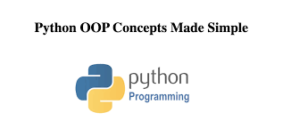

# PYTHON-OOP
# Object Oriented Programming Python



Python adalah bahasa pemrograman yang mendukung paradigma Object Oriented Programming (OOP).
OOP memungkinkan kita untuk membuat kelas dan objek yang merepresentasikan entitas real atau abstrak. Berikut adalah beberapa konsep dasar dari OOP di Python:

## Bagian OOP

- **Kelas (Class)**: Objek adalah instansi dari kelas. Objek memiliki atribut dan metode yang ditentukan oleh kelas..

- **Atribut (Attribute)**: Atribut adalah variabel yang dimiliki oleh kelas atau objek. Atribut dapat digunakan untuk menyimpan data atau informasi yang diperlukan oleh kelas atau objek.

- **Metode (Method)**: Metode adalah fungsi yang dimiliki oleh kelas atau objek. Metode dapat digunakan untuk mengimplementasikan perilaku atau fungsionalitas kelas atau objek.
 
- **Inheritance**: Inheritance adalah konsep di mana kelas turunan (subclass) mewarisi atribut dan metode dari kelas induk (superclass). Inheritance memungkinkan kita untuk mengimplementasikan polimorfisme, yaitu kemampuan kelas turunan untuk mengimplementasikan atau meng override metode dari kelas induk.

- **Encapsulation**: Encapsulation adalah konsep di mana kita mengumpulkan atribut dan metode kelas atau objek ke dalam sebuah kelas atau objek. Encapsulation memungkinkan kita untuk mengatur akses atribut dan metode kelas atau objek, sehingga hanya dapat diakses melalui metode-metode yang telah ditentukan.

- **Abstraction**: Abstraction adalah konsep di mana kita hanya menunjukkan atribut dan metode yang relevan dari kelas atau objek. Abstraction memungkinkan kita untuk membuat kelas atau objek yang lebih mudah dipahami dan digunakan.

- **Polymorphism**: Polymorphism adalah konsep di mana kelas turunan dapat mengimplementasikan atau mengoverride metode dari kelas induk. Polymorphism memungkinkan kita untuk menggunakan kelas turunan sebagai gantinya dari kelas induk, sehingga kita dapat menggunakan metode-metode yang telah ditentukan oleh kelas induk dengan cara yang lebih spesifik atau khusus.

- **Overloading**: Overloading adalah konsep di mana kita dapat membuat lebih dari satu metode dengan nama yang sama, tetapi dengan jumlah atau tipe parameter yang berbeda. Overloading memungkinkan kita untuk mengimplementasikan perilaku yang berbeda untuk metode yang sama, tergantung pada jumlah atau tipe parameter yang digunakan.

- **Overriding**: Overriding adalah konsep di mana kita dapat menggantikan metode dari kelas induk dengan metode baru di kelas turunan. Overriding memungkinkan kita untuk mengimplementasikan perilaku yang berbeda untuk metode


## Instalasi

### Prasyarat

- Python 3.x
- Vscode

### Langkah-langkah Instalasi

1. Clone repositori ini ke komputer Anda:

```sh
git clone https://github.com/khoerulmutaqinkm/PMS-MODUL.git```
```

2. Masuk ke directory:

```sh
cd Python-OOP
```

3. Menjalankan Program

```sh
cd 'Episode #1 Apa itu OOP'
py Main.py
```
